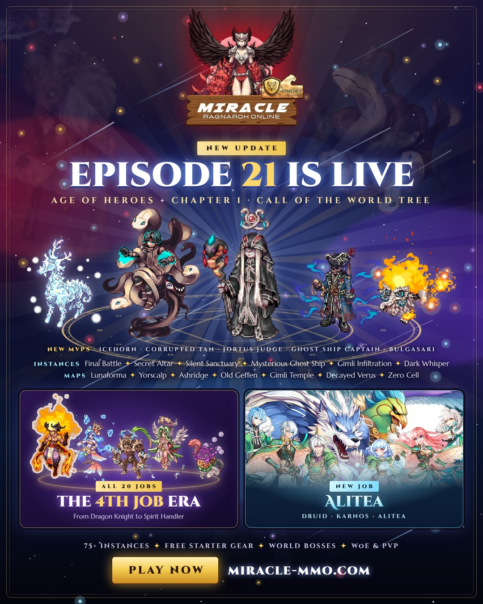

---
hide:
  - navigation
---

# Welcome to Miracle RO

Miracle is a Renewal Ragnarok Online server with high rates, a dedicated **Quest Room**, custom enchanters,
World Boss and Hell Raid events, and daily activities that reward you for simply playing.
This wiki explains every custom NPC and system on the server, with prices and item lists taken straight from the
server's own scripts.

| Server | |
|---|---|
| **Base / Job EXP** | {{ server.exp_rate }} |
| **Drops** | {{ server.drop_rate }} |
| **Content** | up to {{ server.episode }} |
| **Client** | {{ server.client }} |
| **Weekend bonus** | Double EXP and drops every Friday 00:00 to Monday 00:00 |

## Where to start

-   :material-flag-checkered: **[New players](guide/new-players.md)**

    Claim your freebies, get to the Quest Room and learn the main hubs.

-   :material-cash-multiple: **[Currencies & points](guide/currencies.md)**

    Mission, Instance, Event, Card and Activity points: how to earn them and where to spend them.

-   :material-store: **[Shops](shops/index.md)**

    Quest Shop, Instance Point Merchant, World Boss Merchant, the Mall and more.

-   :material-auto-fix: **[Enchants](enchants/index.md)**

    iRO Enchanter, Aulion, Desmond and the wing enchanters, with every possible result.

-   :material-sword: **[Content](content/hunting-missions.md)**

    Hunting Missions, Daily Quests, World Boss, Hell Raid, Mining and the hourly events.

-   :material-database-search: **[Database](db/index.md)**

    Every item, monster, skill and job, with drops, spawn maps, shops and skill trees.

-   :material-castle: **[Official content](official/index.md)**

    {{ official_instance_count() }} official instances, the Eden Group, episode quests and official systems.

-   :material-map-marker: **[NPC directory](npcs.md)**

    Every custom NPC with its map and coordinates.

## The two hubs

**Prontera** is the main town. Around the fountain you will find the Kafra, Hera the healer, the VIP Admin,
the Daily Quest Manager, the World Boss NPC, the Episode Skip NPC and the **Quest Area** NPC
({{ npc_where("Quest Area") }}) that warps you to the Quest Room.

**The Quest Room** (`moc_para01`) is where most custom NPCs live: the Quest Shop, the enchanters, the point
merchants, the Card Trader, Hunting Missions and the gacha machines.

!!! tip "Finding an NPC"
    Every NPC page lists the map and coordinates. Type `/navi <map> <x>/<y>` in game to get a navigation arrow.
